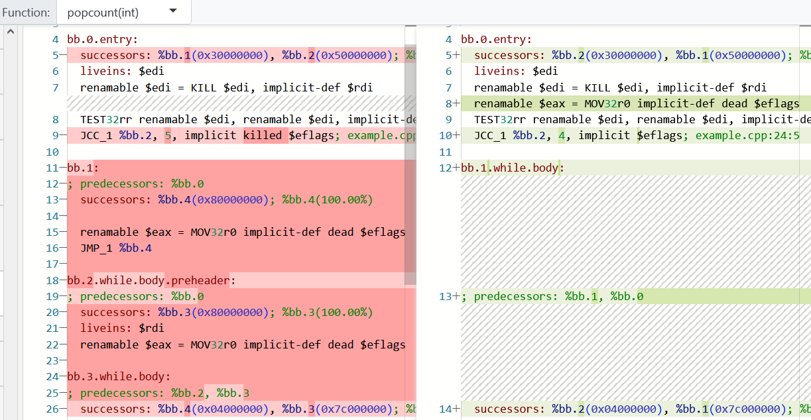

# LLVM Opt Pipeline

The LLVM Opt Pipeline tool (New Pane -> `Opt Pipeline`) shows the compiler passes and the before and after LLVM IR.

For the `Control Flow Optimizer` pass, here is the diff of the LLVM IR before and after:

